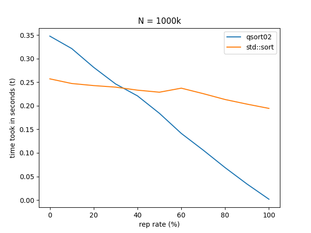

# 实验四: 快速排序

* 根据指导书提供的伪代码实现快速排序
* 使用三路划分改进了排序
* 测试上面两个快速排序和`std::sort`在不同重复率数据上的运行时间，进行对比

## 程序使用说明

* 使用`make`进行编译，`./main [N]`运行，默认N为1e5，N是待排序的数组大小，测试重复率为`0%,10%,...,100%`下的运行时间
* 保存了N为10K，100K，1000K下的运行时间数据，可以使用`python draw.py`进行绘图（这里N为1000k的时候第一种快排实现运行过慢，没有包含它）
* 绘图如下
  * `N=10k`

    

  * `N=100k`

    

  * `N=1000k`

    

## 结果分析

* 可以看出当元素重复率逐渐增高时，第一种快排实现运行时间上升非常快（是由于在partition时，分得不均匀，一侧可能只有一个或几个元素，时间复杂度降为O(n^2)）
* 而系统的快排实现中规中矩，运行时间比较稳定，因为它并不是单纯的快排实现，而是几种排序方法的混合体，叫做introsort
  * 它开始于快排
  * 如果递归层数过深会改用heapsort
  * 当数据量小于某个阈值改为插入排序
  * 采用三数取中划分（Median-of-3 partition）
* 采用三路划分优化的快排对于重复元素的优化特别好，重复率越高，复杂度越趋于`O(n)`
